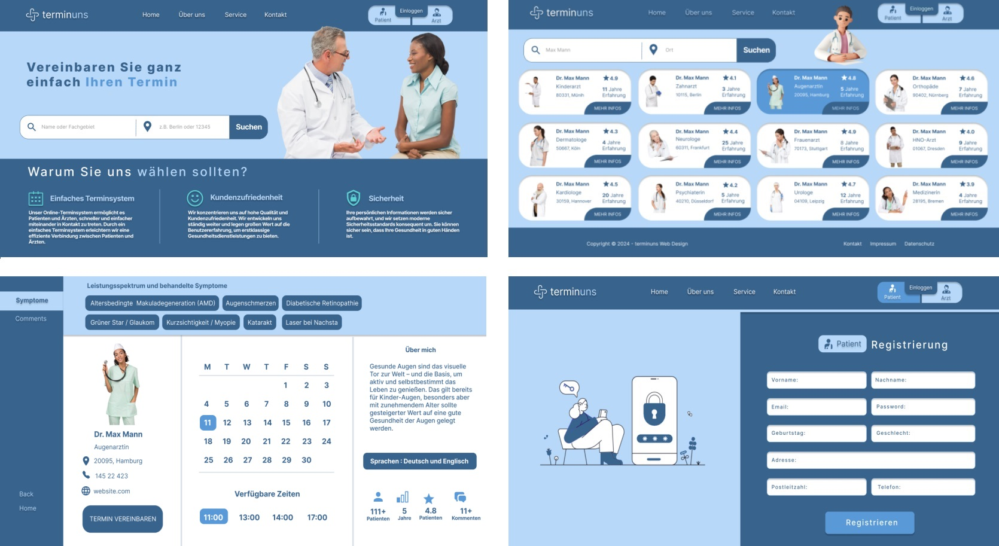

# Patient-Doctor Appointment App

A comprehensive healthcare management system that connects patients with doctors, featuring appointment scheduling, real-time health monitoring, and secure communication.

## Features

- Patient and Doctor Authentication
- Appointment Scheduling
- Real-time Health Monitoring with ESP32
- Secure Messaging System
- Task Management
- File Upload and Management
- Responsive Design

## Tech Stack

### Frontend
- React.js
- Redux Toolkit
- Axios
- Material-UI
- React Router

### Backend
- Node.js
- Express.js
- MongoDB
- JWT Authentication
- Multer for File Upload

### Hardware
- ESP32 Microcontroller
- Temperature Sensors (LM35, DS18B20)
- Pulse Sensor
- LCD Display

## Setup Instructions

### Prerequisites
- Node.js (v14 or higher)
- MongoDB
- Arduino IDE (for ESP32)
- Git

### Backend Setup
1. Navigate to the Backend directory:
   ```bash
   cd Backend
   ```
2. Install dependencies:
   ```bash
   npm install
   ```
3. Create a .env file with the following variables:
   ```
   PORT=8000
   MONGODB_URI=your_mongodb_uri
   JWT_SECRET=your_jwt_secret
   FRONTEND_URL=your_frontend_url
   NODE_ENV=production
   ```
4. Start the server:
   ```bash
   npm start
   ```

### Frontend Setup
1. Navigate to the Frontend directory:
   ```bash
   cd Frontend
   ```
2. Install dependencies:
   ```bash
   npm install
   ```
3. Create a .env file with the following variables:
   ```
   REACT_APP_BASE_URL=your_backend_url
   REACT_APP_API_URL=your_backend_url/api
   ```
4. Start the development server:
   ```bash
   npm start
   ```

### ESP32 Setup
1. Open the Arduino IDE
2. Install required libraries:
   - WiFi
   - WebServer
   - OneWire
   - DallasTemperature
   - Wire
   - LiquidCrystal_I2C
   - PulseSensorPlayground
   - ArduinoJson
   - HTTPClient
3. Update the following in the code:
   - WiFi credentials
   - Backend server URL
   - Device ID
4. Upload the code to ESP32

## Deployment

### Backend Deployment (Render.com)
1. Create a new Web Service
2. Connect your GitHub repository
3. Set build and start commands
4. Add environment variables

### Frontend Deployment (Vercel)
1. Import your GitHub repository
2. Configure build settings
3. Add environment variables

## Contributing
1. Fork the repository
2. Create your feature branch
3. Commit your changes
4. Push to the branch
5. Create a Pull Request

## License
This project is licensed under the MIT License.





## Technologies used - tools
 
**Frontend:**
- React
- Redux Toolkit
- Hooks (such as useCallback, useRef, useEffect, useState)
- Axios
- Toastify
- TailwindCSS
- Material-UI (Mui)
- Formik-Yup
- React-Google-Charts
- React-DOM
- React-Calendar
- Tremor
- React-Scripts
- Redux-Persist
- Fullcalendar
- React-Hook-Form 

**Backend:**
- Node.js
- JavaScript
- MongoDB
- Mongoose
- Express.js
- dotenv
- cors
- cookie-session
- express-async-errors
- morgan
- multer
- nodemailer
- redoc-express
- swagger-autogen

## Project Details:

**Simple Appointment System**
Our online appointment system allows patients and doctors to connect more quickly and easily. With a simple appointment system, we facilitate efficient communication between patients and doctors.

**Customer Satisfaction**
We focus on high quality and customer satisfaction. We are constantly evolving and place great emphasis on user experience to provide top-notch healthcare services.

**Security**
Your personal information is securely stored, and we consistently implement modern security standards. You can rest assured that your health is in good hands.

**Online Appointment Booking**
Our online appointment scheduling tool provides a user-friendly interface for quick and easy appointment planning for both patients and doctors.

**Doctor Registration & Profile Management**
Doctors have the option to create and update their profiles, specifying their areas of expertise and working hours.

**Patient Registration & Profile Management**
We offer services for creating and updating patient records, securely storing health history and personal information in the patient profile.

**Communication between Doctor and Patient**
Our platform enables effective communication between doctor and patient through various options such as messaging. Questions can be clarified both before and after the appointment.

**Notification & Reminder Service**
With our service, you will receive reminder messages on the day of the appointment, as well as instant notifications and emails about appointment changes or cancellations.

**Adding Notes and Tasks**
Patients and doctors can add daily tasks and general notes.

**Data Security & Privacy**
The security and confidentiality of your patient data are our top priority. We apply encryption and protection protocols for all data transmissions.

We are proud to offer you an innovative and secure platform for healthcare. If you have any questions, we are available at any time.

**How AlphaHeart App work?**
- Doctors and patients must be registered to the system in order to be able to use it. Non-registered users can search for doctors and free appointments, but must be registered to have a patient panel and to get appointments.
After a doctor registers himself/herself to the system, she/he must enter her/his doctor panel and fill the information form. the form also includes the proof of the doctor's background like diplom and certificates.
When a doctor sends all the information to the system, the website admin will check the eligibility and validity of the documents and approve/authorize the doctor's account.
Now, the doctor can reach her/his panel. In the first step, she/he should enter weekly working hours to the system in Einstellungen page. This step is critical because the doctor should rigoriously specify her/his date range for using the AlphaHeart-App. After she/he creates the appointments, patients will be able to get appointments and in a case of mistakenly created free appointments, it will be difficult to cancel all these appointments.
- A patient needs no admin validation to use the system in the beginning. After she/he registers herself/himself, she/he can automatically access her/his panel.
A patient can search for not only doctors in close locations and but also the branches. After she/he lists the doctors by relevance, she/he can see also doctors' free appointments and get an appointment.
After an appointment is taken, the patient will get an email notification. She/he can see all of incoming and the past appointments in the Überblick(Overview) page.
- Doctors can also see all of their daily appointments in Überblick(Overview) page in their panel. They can see their past and future appointments in Kalender(Calendar) page. Patients are also able to see their past and future appointments.
Patients and doctors can see national or regional holidays in their Überblick(Overview) and Kalender(Calendar) pages.
Patients and doctors can cancel their appointments and specify a reason for the cancellation. The cancel operation can be conducted if there are more than 24 hours to the appointment. When an appointment is cancelled, both of the parties will get notifications through their panels and emails.
- Patients and doctors can add important events to their calendars in Kalender(Calendar) pages.
Patients and doctors can create tasks or notes for themselves in Aufgaben(Tasks) and Notizen(Notes) pages.
Patients and doctors can see their statistics in Statistik(Statistics) pages. These statistics involve the ratio of cancelled and realized appointments, the number of appointments in the last week, last month and the last year, the number of doctors/patients she/he has made appointments, the number of messages and patients/doctors she/he has sent/received and the website new user statistics.
- Patients and doctors can send messages to patients/doctors and receive messages from them. After each message, they will be warned via navbar.
Patients and doctors can edit their profiles whenever they want, they can add profile pictures.
Dark theme is coming soon...
language options is also in creation process...

**There are 3 different dashboards** 
Patient dashboards - Doctor dashboards - Admin dashboards

---

**Frontend:**
- Created using React.
- Utilizes libraries such as React Router, Tailwind, Formik, Yup, and Toastify.

**Backend:**
- Developed with Node.js and Express.js.
- Utilizes MongoDB as the database, integrated with Mongoose.

**Authentication and Authorization:**
- User authentication is managed using Token Authentication.
- Authorization is implemented using React Router's security features.

**Project Structure:**

- **client:** Frontend code 
  - **src:**
    - **components:** React components
    - **pages:** Application pages
    - **utils:** Helper functions and constants

- **server:** Backend code
  - **controllers:** MongoDB operations and business logic
  - **models:** MongoDB schemas
  - **routes:** API routes
